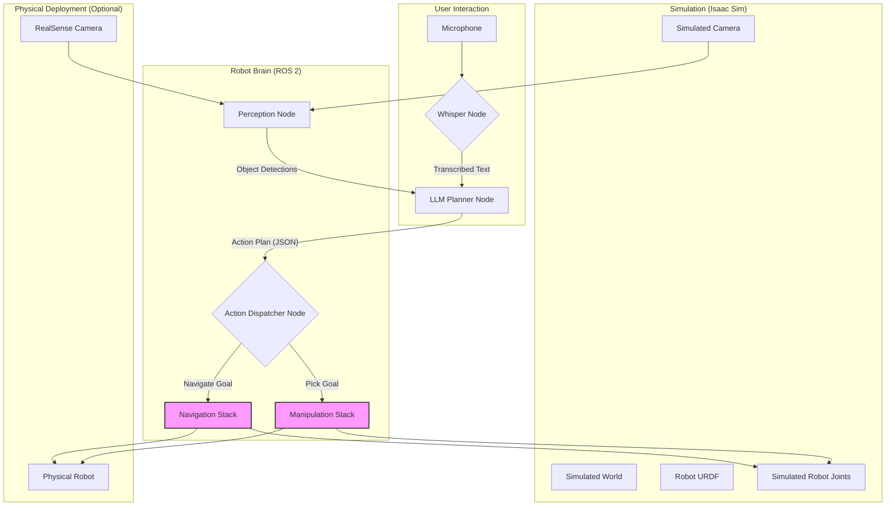

import Admonition from '@theme/Admonition';

# Capstone Project: The Autonomous Humanoid

<Admonition type="info" title="Project Goal">
  
The capstone project is the culmination of all the skills learned throughout this course. Your team will design, simulate, and deploy a complete Vision-Language-Action (VLA) pipeline on a simulated robot. The final goal is to have a robot that can respond to a natural language voice command to identify, navigate to, and interact with an object in a simulated environment.

</Admonition>

## System Architecture

Your system must be designed as a modular, ROS 2-based architecture. The following diagram illustrates the minimum required components and data flow.

**Component Breakdown:**
1.  **Whisper Node:** A ROS 2 node that captures audio, transcribes it using OpenAI Whisper, and publishes the resulting text.
2.  **Perception Node:** A ROS 2 node that processes images from the robot's camera to detect and locate objects in the environment.
3.  **LLM Planner Node:** The "cognitive core." This node receives the user's text command and the list of perceived objects. It queries a Large Language Model (LLM) to generate a high-level plan (e.g., `[move_to(table), pick_up(apple)]`).
4.  **Action Dispatcher Node:** This node subscribes to the plan from the LLM. It translates each step of the plan into specific ROS 2 Action calls to the navigation and manipulation stacks.
5.  **Navigation Stack (Nav2):** The standard Nav2 stack, configured to receive goal poses and output velocity commands.
6.  **Manipulation Stack:** A set of nodes responsible for controlling the robot's arm and gripper. For the capstone, this could be a simplified action server that executes pre-programmed picking motions.

## Project Workflow

The project will be executed in three phases over the final weeks of the course.

### Phase 1: System Design & Simulation Setup
- **Tasks:**
    1.  Finalize your team's specific system architecture diagram.
    2.  Design the custom ROS 2 messages and actions needed for your components to communicate.
    3.  Build your simulation environment in Isaac Sim. This world should contain the robot, the target objects, and any necessary furniture or obstacles.
    4.  Spawn your robot's URDF in the simulation and ensure all joints can be controlled via ROS 2 topics.
- **Deliverable:** A detailed design document and a working, empty simulation world.

### Phase 2: Core Module Implementation
- **Tasks:**
    1.  Implement the full perception-cognition-action pipeline (Whisper -> LLM -> Dispatcher).
    2.  Implement the Perception Node. You can use a pre-trained object detection model (like YOLO) or the synthetic data generation tools in Isaac Sim to train your own.
    3.  Implement the simplified Manipulation action server.
    4.  Integrate and test the Nav2 stack with your simulated robot.
- **Deliverable:** A video demonstrating the robot successfully executing a hard-coded plan (e.g., navigating to a table and attempting a pick).

### Phase 3: Integration & Final Demo
- **Tasks:**
    1.  Integrate all components into the final system.
    2.  Thoroughly test the end-to-end pipeline, from voice command to final action.
    3.  (Optional) Deploy the system to a physical robot (e.g., the Unitree Go2) and demonstrate Sim-to-Real functionality.
- **Deliverable:** A live demo of the full system and a final project report.

## Evaluation Rubric

Projects will be graded on the following criteria:

| Category | Weight | Description |
| :--- | :--- | :--- |
| **System Architecture (20%)** | 20% | Is the ROS 2 architecture well-designed, modular, and robust? Is the design document clear and professional? |
| **Perception & Cognition (30%)**| 30% | How well does the robot perceive its environment? Is the LLM-based planning effective and reliable? |
| **Navigation & Manipulation (30%)**| 30% | Does the robot navigate without collision? Is the manipulation successful? Is the integration with Nav2 and the arm controller working correctly? |
| **End-to-End Demo (20%)** | 20% | How well does the complete system perform during the live demo? Is the pipeline robust to minor variations? |
| **Bonus: Physical Deployment** | +10% | Did the team successfully deploy their pipeline to a physical robot and demonstrate it working? |
