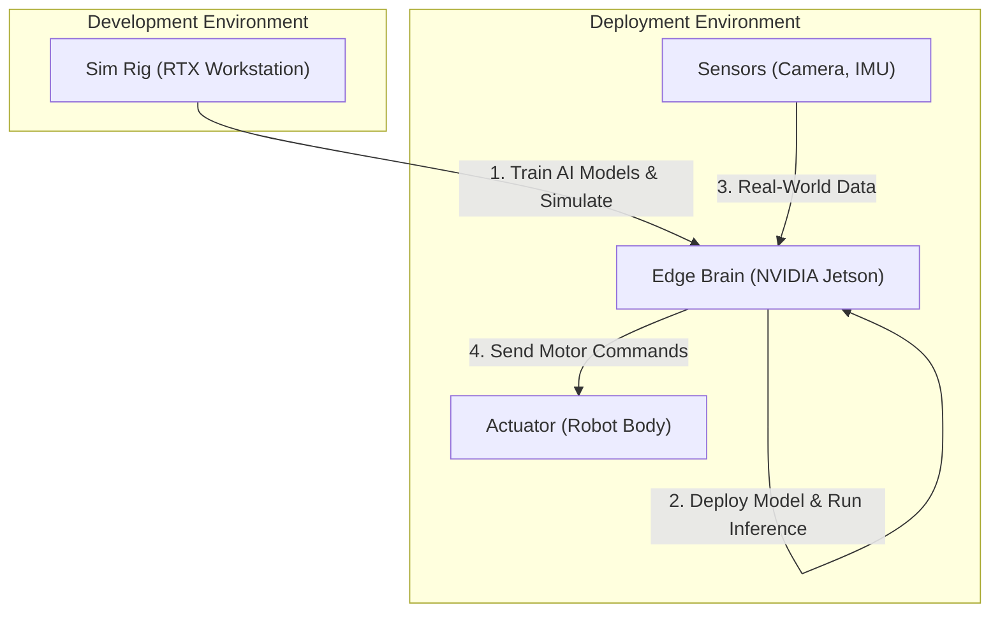

import Admonition from '@theme/Admonition';

# Hardware & Infrastructure Setup

<Admonition type="warning" title="Critical Requirement">
  This course is technically demanding. It sits at the intersection of three heavy computational loads: **Physics Simulation**, **Visual Perception**, and **Generative AI**. Standard laptops, including MacBooks or non-RTX Windows machines, **will not work** for local development.
</Admonition>

## The Core Architecture

To teach and develop for this course successfully, your lab infrastructure is split into three main components: the **Sim Rig** for development, the **Edge Brain** for deployment, and the **Physical Actuator** for real-world testing.

1.  **Simulate & Train:** You will use a powerful workstation (the "Sim Rig") to run NVIDIA Isaac Sim, build environments, and train your AI models.
2.  **Deploy:** You then deploy the trained model to a small, power-efficient "Edge Brain" like the NVIDIA Jetson.
3.  **Perceive:** The Edge Brain connects to real-world sensors (like a depth camera) to perceive the environment.
4.  **Act:** Based on the sensor data and the AI model, the Edge Brain sends commands to the physical robot body (the "Actuator").

---

## Tier 1: The "Digital Twin" Workstation (Required)

This is the most critical component for every student. It is used to run NVIDIA Isaac Sim, which requires a powerful NVIDIA RTX GPU.

| Component | Minimum Specification | Recommended Specification | Rationale |
| :--- | :--- | :--- | :--- |
| **GPU** | NVIDIA RTX 3070 (8GB VRAM) | **NVIDIA RTX 4070 Ti (12GB+)** | **The Bottleneck.** High VRAM is essential for loading robot/environment assets (USDs) and running VLA models simultaneously. An RTX 3090/4090 (24GB) is ideal for heavy Sim-to-Real training. |
| **CPU** | Intel Core i5 (12th Gen+) | **Intel Core i7 (13th Gen+)** / AMD Ryzen 9 | Physics calculations in Gazebo and Isaac Sim are CPU-intensive. More cores and higher clock speeds will significantly reduce simulation time. |
| **RAM** | 32 GB DDR4 | **64 GB DDR5** | 32GB is the absolute minimum but may struggle or crash during complex scene rendering and AI model loading. |
| **OS** | **Ubuntu 22.04 LTS** | Ubuntu 22.04 LTS (Dedicated) | **Mandatory.** While Isaac Sim runs on Windows, ROS 2 is native to Linux. A dedicated Linux install or dual-boot is required for a friction-free experience. |

### Cloud-Based Alternative

If acquiring RTX workstations is not feasible, students can rent cloud instances.

| Cloud Option | Instance Type (Example) | Estimated Cost (per student) | Pros & Cons |
| :--- | :--- | :--- | :--- |
| **AWS** | `g5.2xlarge` | ~$205 / quarter | **Pro:** Accessible from any machine. **Con:** High operational cost (OpEx), network latency can be an issue. |
| **Azure** | `Standard_NC6s_v3` | Similar to AWS | **Pro:** Integrates with other Azure services. **Con:** Similar cost and latency challenges. |

<Admonition type="danger" title="The Latency Trap">
Controlling a physical robot from a cloud instance in real-time is dangerous due to network latency. The correct workflow is: **Train in the Cloud -> Download the AI Model -> Deploy to a Local Edge Device.**
</Admonition>

---

## Tier 2: The "Physical AI" Edge Kit (Required for Physical Deployment)

This kit acts as the robot's "brain" and allows students to deploy their code from the powerful workstation to a real, physical device.

| Component | Model | Approx. Price | Notes |
| :--- | :--- | :--- | :--- |
| **The Brain** | NVIDIA Jetson Orin Nano (8GB Super Dev Kit) | $249 | The industry standard for embodied AI. The new "Super" kit includes a Wi-Fi module and is powerful enough (40 TOPS) for our perception stack. |
| **The Eyes** | Intel RealSense D435i | $349 | Provides both color (RGB) and depth data. The `-i` variant is crucial as it includes a built-in IMU for SLAM. |
| **The Ears** | ReSpeaker USB Mic Array v2.0 | $69 | A far-field microphone needed for the voice command module (Whisper). |
| **Misc.** | High-Endurance 128GB microSD Card | $30 | A high-speed, durable microSD card is required for the OS and to handle constant read/write operations. |
| **TOTAL** | | **~$700** | (per kit) |

---

## Tier 3: The Robot Lab (Actuators)

This is the physical body of the robot. The choice here depends heavily on budget. For this course, it is recommended that the lab has a small number of shared robots that students can deploy their capstone projects to.

| Option | Robot Model(s) | Approx. Price | Pros & Cons |
| :--- | :--- | :--- | :--- |
| **A: The "Proxy"** | Unitree Go2 Edu | $1,800 - $3,000 | **(Recommended)** **Pro:** Highly durable, excellent ROS 2 support, affordable. 90% of software principles transfer to humanoids. **Con:** Not a biped. |
| **B: Miniature Humanoid**| Robotis OP3 or Unitree G1 | $12,000 - $16,000 | **Pro:** A true humanoid form factor. **Con:** Very expensive, less durable than a quadruped. |
| **C: The "Premium" Lab** | Unitree G1 Humanoid | $90,000+ | **Pro:** A state-of-the-art, full-size humanoid for advanced Sim-to-Real research. **Con:** Extremely high cost, suitable for dedicated research labs only. |

<Admonition type="tip" title="Budget-Conscious Approach">
  A highly effective lab can be built with **one Unitree Go2** and **multiple Jetson Edge Kits**. Students do all their development on their workstations, test deployment on their personal Jetson kit, and then book time on the shared Go2 robot for final validation.
</Admonition>
