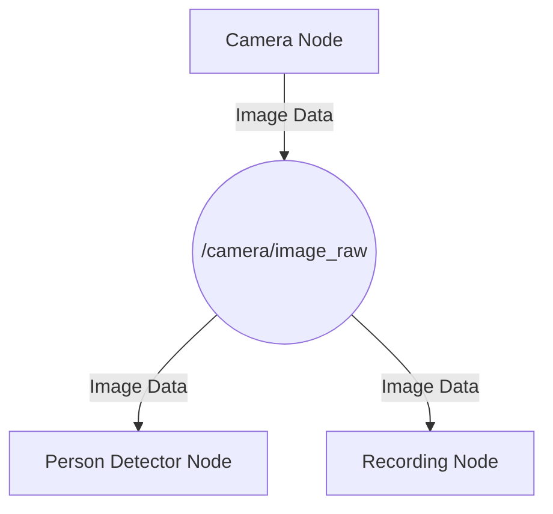

import Admonition from '@theme/Admonition';

# Module 1: The Robotic Nervous System (ROS 2)

<Admonition type="info" title="Module Focus">
  <p>This module introduces the Robot Operating System (ROS 2), the middleware that acts as the nervous system for our humanoid robots. You will learn how to structure robot software, manage data flow, and bridge high-level Python code with low-level robot controllers.</p>
</Admonition>

## 1.1 Introduction: Why Middleware is Essential

In any complex robot, dozens of processes need to run simultaneously. Sensors (like cameras and LiDAR) generate data, control algorithms calculate joint movements, navigation stacks plan paths, and a user interface might need to report status. Without a structured communication system, this would be chaos.

ROS provides this structure. It is not an operating system in the traditional sense (like Windows or Linux), but a **middleware**. It provides a standardized messaging layer that allows distributed and modular software components to communicate with each other, regardless of what machine they are running on or what language they are written in.

**Key benefits of using ROS:**
- **Modularity:** ROS encourages breaking down complex problems into small, independent programs called "nodes."
- **Distributed Communication:** Nodes can run on different computers and communicate seamlessly over the network.
- **Rich Ecosystem:** ROS comes with thousands of pre-built packages for everything from SLAM and navigation to manipulation and computer vision.
- **Language Agnostic:** You can write nodes in Python, C++, and other languages.

## 1.2 The Core Concepts of ROS 2

ROS 2 is built around a few key concepts that form the basis of all communication.

### Nodes
A **Node** is the fundamental processing unit in ROS 2. Think of it as a single-purpose executable. For a humanoid robot, you might have separate nodes for:
- A `camera_driver` node that publishes image data.
- A `person_detector` node that subscribes to images and publishes the coordinates of detected people.
- A `navigation` node that subscribes to person coordinates and plans a path.
- A `motor_controller` node that subscribes to path commands and moves the robot's joints.

### Topics, Publishers, and Subscribers
Nodes communicate by publishing messages to **Topics**. A topic is simply a named bus for data, like a channel.
- A **Publisher** is a node that sends messages to a topic.
- A **Subscriber** is a node that receives messages from a topic.

This is a one-to-many communication pattern. Many nodes can subscribe to the same topic, and a single node can publish to multiple topics.



### Services and Clients
While topics are for continuous data streams, **Services** are used for request/response interactions. This is a one-to-one communication pattern.
- A **Service Server** node advertises a service and provides a response when called.
- A **Service Client** node calls the service and waits for the response.

This is useful for actions that need to complete before the program continues, such as "move the arm to a specific coordinate and confirm when it has arrived."

## 1.3 rclpy: Bridging Python to ROS
`rclpy` is the official ROS 2 client library for Python. It allows you to write full-featured ROS 2 nodes in Python, giving you access to all the core communication mechanisms.

### Example: A Simple Python Publisher

Here is a basic example of a Python node that publishes a "Hello, World" message to a topic.

```python
import rclpy
from rclpy.node import Node
from std_msgs.msg import String

class HelloWorldPublisher(Node):
    def __init__(self):
        super().__init__('hello_world_publisher')
        self.publisher_ = self.create_publisher(String, 'hello_topic', 10)
        self.timer = self.create_timer(0.5, self.timer_callback)
        self.i = 0

    def timer_callback(self):
        msg = String()
        msg.data = f'Hello, ROS 2 World: {self.i}'
        self.publisher_.publish(msg)
        self.get_logger().info(f'Publishing: "{msg.data}"')
        self.i += 1

def main(args=None):
    rclpy.init(args=args)
    publisher_node = HelloWorldPublisher()
    rclpy.spin(publisher_node)
    publisher_node.destroy_node()
    rclpy.shutdown()

if __name__ == '__main__':
    main()
```

<Admonition type="tip" title="Code Explanation">
  <ul>
    <li>We import `rclpy` and the `Node` class, along with the `String` message type.</li>
    <li>Our `HelloWorldPublisher` class inherits from `Node`.</li>
    <li>In `__init__`, we create a publisher for `String` messages on the topic `hello_topic`.</li>
    <li>A timer calls the `timer_callback` function every 0.5 seconds.</li>
    <li>The `timer_callback` creates a `String` message, publishes it, and logs to the console.</li>
    <li>The `main` function initializes rclpy, creates an instance of our node, and `spin`s it to keep it alive and responsive to callbacks.</li>
  </ul>
</Admonition>

## 1.4 URDF: Describing the Humanoid
The **Unified Robot Description Format (URDF)** is an XML format used to model a robot's physical structure. It is the blueprint of your robot. A URDF file defines:
- **Links:** The rigid parts of the robot (e.g., torso, upper arm, forearm).
- **Joints:** The connections between links, defining how they can move (e.g., revolute for a rotating elbow, prismatic for a sliding part).
- **Visuals:** The 3D meshes that represent what the robot looks like.
- **Collisions:** The simplified shapes used by the physics engine to calculate collisions.
- **Inertia:** The mass and rotational inertia of each link.

This file is crucial because it is used by simulators (like Gazebo) to render the robot and by control tools (like RViz) to visualize its state.

### Exercises
1.  **Setup Your Environment:** Install ROS 2 Humble on Ubuntu 22.04. Create a new ROS 2 workspace.
2.  **Write a Subscriber:** Create a Python node that subscribes to the `/hello_topic` and prints the received messages to the console.
3.  **Create a Service:** Design a simple ROS 2 service that takes an integer `A` and `B` and returns their sum. Write both the service server and a client to test it.
4.  **Explore a URDF:** Find the URDF for a well-known robot (like the TurtleBot3 or a public humanoid robot) and identify its main links and joints.

### Quiz
1. What is the primary difference between a ROS Topic and a ROS Service?
2. In `rclpy`, what is the function of `rclpy.spin()`?
3. What are the three essential components defined for each `link` in a URDF file for simulation?
4. Can a single ROS node publish to multiple topics? Can it subscribe to multiple topics?
