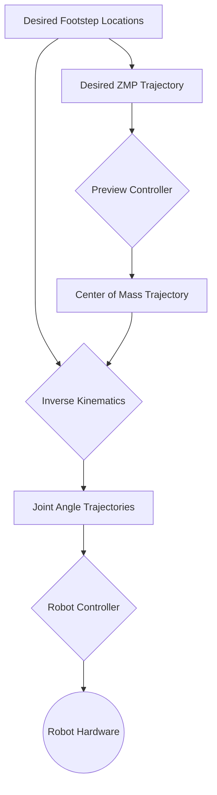

import Admonition from '@theme/Admonition';

# Module 5: Bipedal Locomotion

<Admonition type="info" title="Module Focus">
  
This module tackles one of the grand challenges of humanoid robotics: achieving stable, efficient, and dynamic bipedal locomotion. We will explore the fundamental principles of kinematics and dynamics, investigate classic and modern gait generation algorithms, and delve into the control strategies required to keep a two-legged robot balanced while walking, running, and navigating the world.

</Admonition>

## 5.1 The Challenge of Walking on Two Legs

Walking is something humans do without conscious thought, but for a robot, it is an incredibly complex act of "controlled falling." Unlike wheeled robots, bipedal robots are inherently unstable. Their center of mass is high, and their base of support (the area under their feet) is very small.

**Key Challenges:**
- **Maintaining Balance:** The robot must constantly shift its weight and adjust its posture to keep its center of mass over its support polygon.
- **Dynamic Stability:** Stable walking requires forward momentum. The robot must be stable not just when standing still, but while in motion.
- **High Degrees of Freedom (DoF):** A typical humanoid has over 20 joints in its legs and torso that must be coordinated precisely.
- **Underactuation:** The robot is not fixed to the ground. The contact between the feet and the floor is a passive, uncontrolled interaction.

## 5.2 Kinematics and Dynamics: The Language of Motion

To control a humanoid, we must first be able to describe its motion mathematically.

### Forward and Inverse Kinematics
- **Forward Kinematics** answers the question: Given a set of joint angles, where are the robot's feet, hands, and head in space? This is used to understand the robot's current configuration.
- **Inverse Kinematics (IK)** answers the opposite question: To place the foot at a specific target location, what should all the leg's joint angles be? IK is fundamental to gait generation, as it allows us to plan footstep locations and then calculate the necessary joint movements to achieve them.

### Rigid Body Dynamics
Dynamics deals with the forces and torques that cause motion. For a humanoid, we are concerned with the relationship between joint torques, the robot's acceleration, and the external forces acting on it (like gravity and ground contact forces). A dynamic model is essential for advanced control strategies that reason about the robot's momentum and balance.

## 5.3 Gait Generation Algorithms

A gait is the pattern of leg movements that produces locomotion. We will explore two primary approaches to generating these patterns.

### 1. Trajectory-Based Gaits
This classic approach involves pre-computing or generating smooth trajectories for the robot's joints and center of mass over time.
- **Zero Moment Point (ZMP):** A widely used and foundational concept. The ZMP is the point on the ground where the net moment due to gravity and inertia is zero. For the robot to be stable, the ZMP must always remain within the support polygon (the area defined by the feet on the ground). ZMP-based gait planners generate trajectories for the center of mass and feet that satisfy this condition.
- **Preview Control:** An enhancement to ZMP, where the controller "looks ahead" at the planned ZMP trajectory for the next few steps to generate smoother and more robust center of mass movements.

### 2. Model Predictive Control (MPC)
MPC is a more advanced, optimization-based approach. Instead of just following a pre-computed trajectory, an MPC controller:
1. **Predicts** the robot's motion for a short time horizon (e.g., the next 1-2 seconds) using a dynamic model.
2. **Optimizes** the control inputs (e.g., foot placement and joint torques) over that horizon to find the best possible actions that minimize a cost function (e.g., minimize error from a desired velocity while maximizing stability).
3. **Executes** only the first step of that optimal plan.
4. **Repeats** the process at every control step, incorporating new sensor data.

MPC is computationally intensive but allows the robot to react to disturbances (like a push) and adapt its gait in real-time.

## 5.4 Stability Control and Balance

Even with a perfect gait plan, the real world is unpredictable. A balance controller is needed to react to sensory feedback and keep the robot from falling.

**Common Balance Strategies:**
- **Ankle Strategy:** For small disturbances, the robot can generate torque at the ankles to shift its center of pressure, much like a person swaying slightly while standing.
- **Hip Strategy:** For larger disturbances, the robot can bend at the hips and waist to shift its center of mass, counteracting the push.
- **Stepping Strategy:** For very large disturbances, the only way to recover is to take a step to create a new, more stable base of support. A robust balance controller must be able to trigger an emergency step when needed.

### Assignment Tasks
1.  **Inverse Kinematics Solver:** Write a simple 2D IK solver for a two-link robot arm using basic trigonometry. Given a target (x, y) coordinate, calculate the required angles for the two joints.
2.  **ZMP Analysis:** Given a short trajectory of a robot's center of mass and foot positions, calculate the ZMP trajectory and determine if the robot was stable at all times.
3.  **Balance Simulation:** In a simple physics simulator (like PyBullet), create a simple inverted pendulum model. Implement a basic PD controller to keep it balanced upright.
